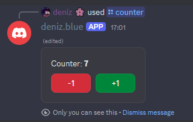

# discord-jsx-renderer

[](https://deniz.blue/discord-invite?id=1197520507617153064)
[](https://github.com/deniz-blue/discordjsx)
[](https://www.npmjs.com/package/discord-jsx-renderer)
[](https://www.npmjs.com/package/discord-jsx-renderer)


A custom [React Renderer](https://www.npmjs.com/package/react-reconciler) for use with [Discord.js](https://discord.js.org/)

You can use all sorts of react features including **state**, **context**, **effects** and more.

## Examples



**Code:**

```jsx
export const Counter = () => {
    const [count, setCount] = useState(0);

    return (
        <message v2 ephemeral>
            <container>
                <text>
                    Counter: **{count}**
                </text>
                <row>
                    <button
                        style="danger"
                        onClick={() => setCount(c => c - 1)}
                    >
                        -1
                    </button>
                    <button
                        style="success"
                        onClick={() => setCount(c => c + 1)}
                    >
                        +1
                    </button>
                </row>
            </container>
        </message>
    )
};
```

**More examples:**
- [TicTacToe (2 players)](https://github.com/deniz-blue/games-bot/blob/c3ce8f573ecdf194d45839fc3303cc8331beec0a/src/games/TicTacToe.tsx)
- [With react-router](https://github.com/deniz-blue/games-bot/blob/c3ce8f573ecdf194d45839fc3303cc8331beec0a/src/experiments/ReactRouterExperiment.tsx)

## Installation

Simply install `discord-jsx-renderer` and `react` with your package manager of choice:

```sh
npm add discord-jsx-renderer react
```

The package exports the singleton `djsx` for managing component instances.

For `discord-jsx-renderer` to be able to handle event handlers, dont forget to call `djsx.dispatchInteraction` with any interaction events:

```js
client.on(Events.InteractionCreate, (interaction) => {
    djsx.dispatchInteraction(interaction);
});
```

## Documentation

You can view the documentation on [djsx.deniz.blue](https://djsx.deniz.blue). It also includes a Getting Started guide.

## Contributing

Feel free to contribute to this project
