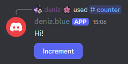

# Counter

Lets build an example counter! This will teach you how to use React state and callbacks.

Assuming you have a slash command, `/counter`, lets create a handler and make it render our custom React component, `Counter`:

```tsx {5}
client.on(Events.InteractionCreate, (interaction) => {
    if(!interaction.isChatInputCommand()) return;
    if(!interaction.commandName !== "counter") return;

    djsx.create(interaction, <Counter />);
});
```

Now, lets define `Counter` as a React function component:

```tsx
const Counter = () => {
    return (
        <message v2>
            <text>
                Hi!
            </text>
        </message>
    )
};
```

But we need to have a button, right? Lets add a button!

```tsx {8-12}
const Counter = () => {
    return (
        <message v2>
            <text>
                Hi!
            </text>
            
            <row>
                <button>
                    Increment
                </button>
            </row>
        </message>
    )
};
```



However, when we click the button, nothing happens.

We can add an event handler to our button like so:

```tsx {2-4,13}
const Counter = () => {
    const clickHandler = () => {
        console.log("Button clicked!");
    };

    return (
        <message v2>
            <text>
                Hi!
            </text>
            
            <row>
                <button onClick={clickHandler}>
                    Increment
                </button>
            </row>
        </message>
    )
};
```

Now when you click **Increment**, it should log the message to the console.

Now, finally, we can add an `useState` react hook to track the counter state:

```tsx {1,4,13}
import { useState } from "react";

const Counter = () => {
    const [count, setCount] = useState(1);

    const clickHandler = () => {
        console.log("Button clicked!");
    };

    return (
        <message v2>
            <text>
                Count: {count}
            </text>
            
            <row>
                <button onClick={clickHandler}>
                    Increment
                </button>
            </row>
        </message>
    )
};
```

And then, inside our click handler, we can use `setCount` to actually increment the state:

```tsx {2}
const clickHandler = () => {
    setCount(c => c + 1);
};
```

Now we have an interactive counter!
