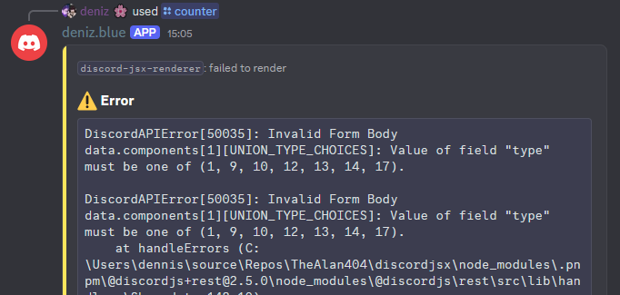

# Rendering Elements

To render JSX elements as Discord messages, use `djsx.createMessage(interaction, element)`:

```tsx
djsx.createMessage(interaction, (
	<message ephemeral>
		Hello {interaction.user}!
		<br/>
		<br/>
		This message was sent with <pre>discord-jsx-renderer</pre>
	</message>
))
```

## Rendering Components

To render custom components, write JSX like you would in React:

```tsx
const MyFunctionComponent = () => {
	// ...
	return (
		<message ephemeral>
			<text>
				Hi! :3
			</text>
		</message>
	);
};

djsx.createMessage(interaction, (
	<MyFunctionComponent />
))
```

## Using State and Hooks

You can use state and any React hook in your components:

```tsx
export const Timer = ({ timeout = 5000 }: { timeout: number }) => {
	const [expired, setExpired] = useState(false);

	useEffect(() => {
		const timeoutId = setTimeout(() => {
			setExpired(true);
		}, timeout);

		return () => clearTimeout(timeoutId);
	}, []);

	return (
		<text>
			Timer {expired ? "has expired!" : "is running..."}
		</text>
	)
};
```

Contexts also work out of the box.


:::

:::

:::


## React Features

You can use almost every React feature with discord-jsx-renderer. Custom components, hooks, state, effects, context and suspense all work out of the box.

Your component can also re-render on its own (due to, for example, a `setInterval` or other side effects), and discord-jsx-renderer will update the discord message/reply automatically.

## Errors

When your JSX elements or components throw an error or you use discord message components incorrectly, discord-jsx-renderer will show an error message:



<!-- TODO: custom error handling tutorial -->

## Deferring

If the **initial render** takes too long on an [Interaction](https://discord.js.org/docs/packages/discord.js/14.19.3/Interaction:TypeAlias) without a message/reply, discord-jsx-renderer will automatically defer the reply.

In the case where a [MessageComponentInteraction](https://discord.js.org/docs/packages/discord.js/14.19.3/MessageComponentInteraction:Class) *created from a discord-jsx-renderer element* does not get a reply/update in time (for example if a component does not re-render) it will automatically get deferred to prevent a "Interaction failed" message.

## Inactivity

Any Discord Interaction token is valid for **15 minutes**. By default, discord-jsx-renderer keeps track of this and just before the token expires, updates the message/reply to have every interactible discord message component (buttons, selects) **disabled**.

You can also use the below snippet to disable components in rendered messages manually before exiting the NodeJS process:

```js
const beforeExit = () => {
	djsx.disable()
		.catch(e => console.log(e))
		.finally(() => process.exit(0));
};

process.on("SIGTERM", beforeExit);
process.on("SIGINT", beforeExit);
```
