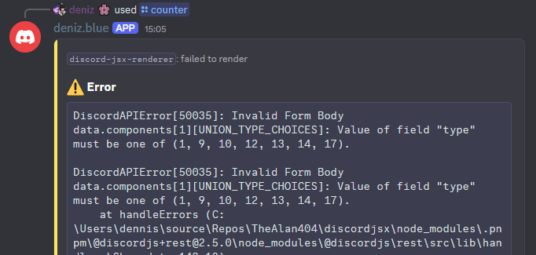

# Rendering JSX

To render some JSX or React components, use the `DJSXRenderer#create(target, element)` method.

`target` can be any of the following:
- Any [Interaction](https://discord.js.org/docs/packages/discord.js/14.19.3/Interaction:TypeAlias) except [AutocompleteInteraction](https://discord.js.org/docs/packages/discord.js/14.19.3/AutocompleteInteraction:Class)
  - If interaction has a message (in case of message component interactions) it will be updated.
  - If interaction does not have a message, discord-jsx-renderer will reply.
- [Message](https://discord.js.org/docs/packages/discord.js/14.19.3/Message:Class)
- [TextBasedChannel](https://discord.js.org/docs/packages/discord.js/14.19.3/TextBasedChannel:TypeAlias) or [User](https://discord.js.org/docs/packages/discord.js/14.19.3/User:Class)
  - Will send a message and keep updating it.

`element` is any JSX element.

```tsx
djsx.create(interaction, (
	<message>
		Hello {interaction.user}!
	</message>
))
```

## React Features

You can use almost every React feature with discord-jsx-renderer. Custom components, hooks, state, effects, context and suspense all work out of the box.

Your component can also re-render on its own (due to, for example, a `setInterval` or other side effects), and discord-jsx-renderer will update the discord message/reply automatically.

## Errors

When your JSX elements or components throw an error or you use discord message components incorrectly, discord-jsx-renderer will show an error message:



<!-- TODO: custom error handling tutorial -->

## Deferring

If the **initial render** takes too long on an [Interaction](https://discord.js.org/docs/packages/discord.js/14.19.3/Interaction:TypeAlias) without a message/reply, discord-jsx-renderer will automatically defer the reply.

In the case where a [MessageComponentInteraction](https://discord.js.org/docs/packages/discord.js/14.19.3/MessageComponentInteraction:Class) *created from a discord-jsx-renderer element* does not get a reply/update in time (for example if a component does not re-render) it will automatically get deferred to prevent a "Interaction failed" message.

## Inactivity

Any Discord Interaction token is valid for **15 minutes**. By default, discord-jsx-renderer keeps track of this and just before the token expires, updates the message/reply to have every interactible discord message component (buttons, selects) **disabled**.

You can also use the below snippet to disable components in rendered messages manually before exiting the NodeJS process:

```js
const beforeExit = () => {
	djsx.disable()
		.catch(e => console.log(e))
		.finally(() => process.exit(0));
};

process.on("SIGTERM", beforeExit);
process.on("SIGINT", beforeExit);
```
